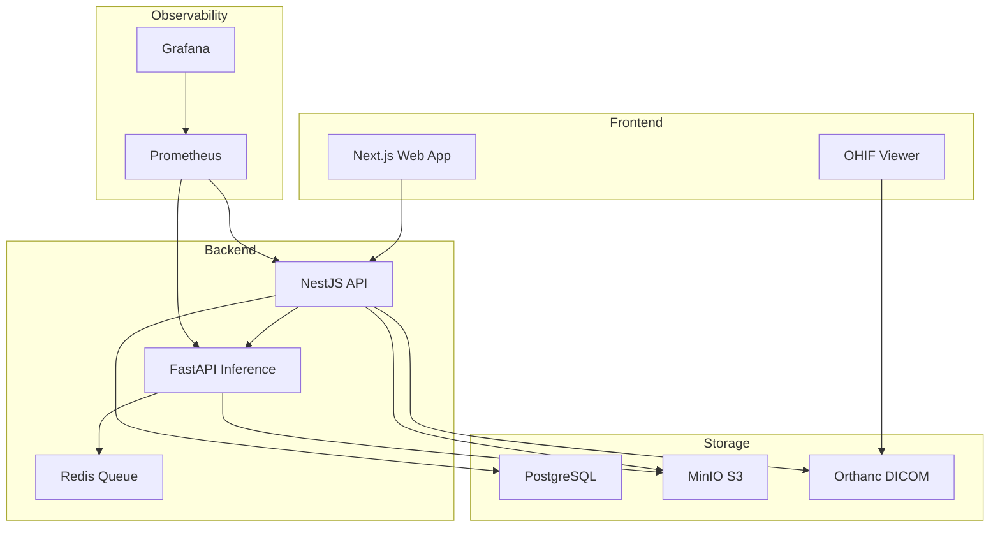

# MediMetrics - Medical Image Analysis Platform

A HIPAA-aware, production-ready medical image analysis system with DICOM support, AI-powered inference, and comprehensive reporting.


## 🚀 Features

- **DICOM Support**: Full DICOM workflow with Orthanc integration and OHIF viewer
- **AI Analysis**: Classification and segmentation with explainable AI (Grad-CAM)
- **Security**: JWT auth, RBAC, field-level encryption, audit logging
- **Compliance**: HIPAA-adjacent controls with PHI minimization
- **Reporting**: Professional PDF reports with findings and confidence scores
- **Observability**: Prometheus metrics and Grafana dashboards

## 📋 Prerequisites

- Docker & Docker Compose v2.20+
- Node.js 18+ (for local development)
- Python 3.11+ (for inference service)
- 8GB RAM minimum (16GB recommended for GPU inference)

## 🏃 Quickstart

```bash
# Clone the repository
git clone https://github.com/your-org/medimetrics-nest.git
cd medimetrics-nest

# Copy environment variables
cp .env.example .env

# Initialize the system (install deps, run migrations, seed data)
make init

# Start all services
docker compose up --build
```

## 🌐 Access Points

| Service | URL | Credentials |
|---------|-----|-------------|
| Web App | http://localhost:3000 | admin@demo.local / Demo123! |
| API Docs | http://localhost:8000/docs | - |
| Orthanc DICOM | http://localhost:8042 | orthanc / orthanc |
| Grafana | http://localhost:3001 | admin / admin |
| MinIO Console | http://localhost:9001 | medimetrics / medimetricssecret |

## 🧪 First-Run Walkthrough

1. **Login**: Navigate to http://localhost:3000 and sign in with demo credentials
2. **Upload**: Go to Dashboard → Upload, drag in `data/fixtures/synthetic/sample1.dcm`
3. **View**: Open the study and click "Open Viewer" to launch OHIF
4. **Analyze**: Click "Run Inference" and select "Demo Classifier"
5. **Results**: Toggle Grad-CAM overlay to see attention heatmaps
6. **Report**: Generate and export a PDF report with findings
7. **Metrics**: Check Grafana for system metrics

## 🏗️ Architecture



## 📁 Project Structure

```
medimetrics-nest/
├── apps/
│   ├── web/          # Next.js frontend
│   ├── api/          # NestJS backend
│   └── inference/    # FastAPI ML service
├── packages/
│   └── shared/       # Shared types and schemas
├── k8s/              # Kubernetes manifests
├── infra/            # Infrastructure configs
├── data/             # Sample data and fixtures
└── scripts/          # Utility scripts
```

## 🔒 Security Features

- **Authentication**: JWT with HttpOnly cookies
- **Authorization**: Role-based access control (RBAC)
- **Encryption**: Field-level encryption for PHI
- **Audit Logging**: Complete access trails with redaction
- **Rate Limiting**: API throttling per endpoint
- **CSRF Protection**: Token validation on state-changing operations
- **Signed URLs**: Short-lived S3 presigned URLs

## 🧪 Testing

```bash
# API tests
docker compose exec api npm test

# Inference tests
docker compose exec inference pytest

# E2E tests
docker compose exec web npm run test:e2e

# All tests
make test
```

## 🚀 Deployment

### Docker Compose (Single VM)

```bash
# Production mode
docker compose --profile prod up -d
```

### Kubernetes

```bash
# Development cluster
kubectl apply -k k8s/overlays/dev

# Production cluster
kubectl apply -k k8s/overlays/prod
```

## 📊 Monitoring

- **Metrics**: Prometheus endpoints at `/metrics`
- **Dashboards**: Pre-configured Grafana dashboards
- **Logs**: Structured JSON logging with PHI redaction
- **Traces**: OpenTelemetry support (optional)

## 🔧 Configuration

Key environment variables:

```bash
# Security
JWT_SECRET=<generate-with-openssl>
FIELD_ENCRYPTION_KEK=<32-byte-key>
WEBHOOK_HMAC_SECRET=<random-secret>

# Storage
S3_ENDPOINT=http://minio:9000
S3_ACCESS_KEY=<your-key>
S3_SECRET_KEY=<your-secret>

# Database
POSTGRES_HOST=postgres
POSTGRES_DB=medimetrics
POSTGRES_USER=postgres
POSTGRES_PASSWORD=<strong-password>
```

## 📚 Documentation

- [API Documentation](http://localhost:8000/docs)
- [Security Guide](SECURITY.md)
- [Compliance Notes](COMPLIANCE.md)
- [Model Card](MODEL_CARD.md)
- [Runbook](RUNBOOK.md)

## ⚠️ Disclaimer

This software is for investigational use only and is not a medical device. See [DISCLAIMER.md](DISCLAIMER.md) for important information.

## 🏥 Production Hardening Checklist

Before handling real PHI:

- [ ] Enable TLS/HTTPS everywhere
- [ ] Use managed services (RDS, ElastiCache, S3)
- [ ] Implement KMS key management
- [ ] Set up centralized logging with PHI redaction
- [ ] Configure WAF and DDoS protection
- [ ] Complete HIPAA security risk assessment
- [ ] Sign BAA with cloud provider
- [ ] Implement backup and disaster recovery
- [ ] Set up monitoring and alerting
- [ ] Conduct penetration testing

## 🤝 Contributing

See [CONTRIBUTING.md](CONTRIBUTING.md) for development guidelines.

## 📄 License

Apache 2.0 - See [LICENSE](LICENSE) for details.

## 🆘 Support

- Issues: [GitHub Issues](https://github.com/your-org/medimetrics-nest/issues)
- Email: support@medimetrics.example
- Documentation: [Wiki](https://github.com/your-org/medimetrics-nest/wiki)

---

Built with ❤️ for the medical imaging community