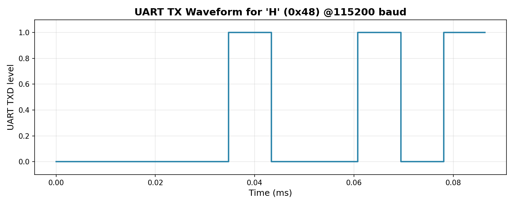
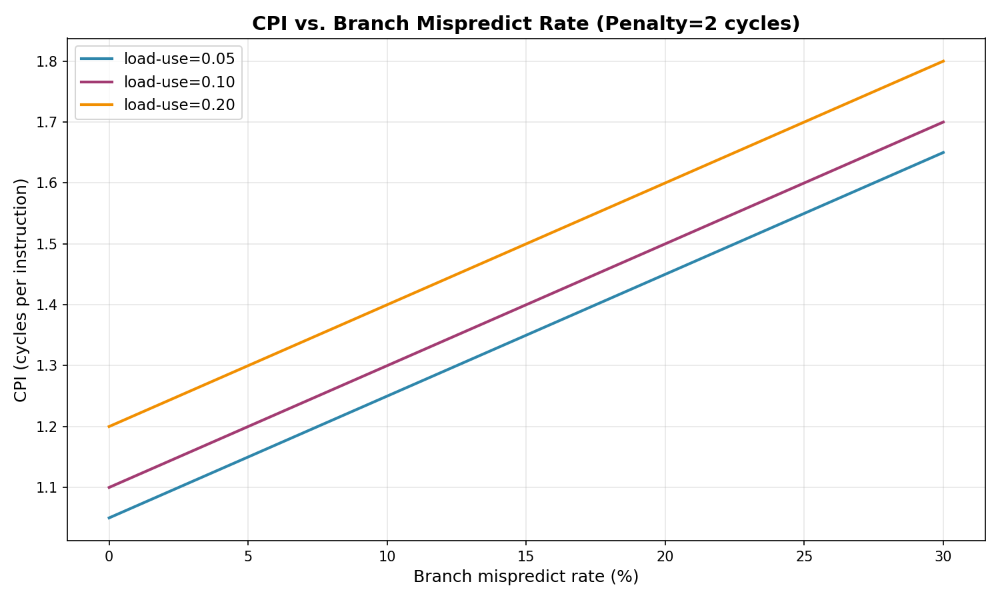
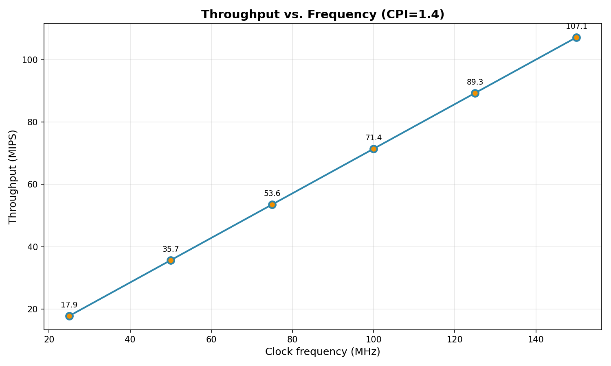
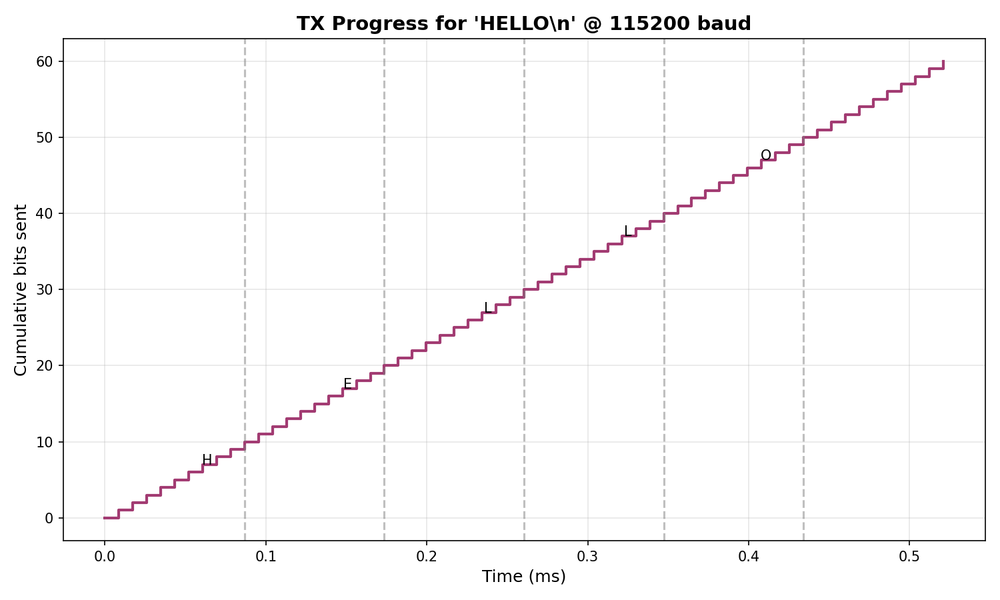

# A Minimal RV32I RISC-V SoC with AXI-Lite Peripherals and UART Console: Design, Simulation, and Performance Modeling

**Author:** Louis Vladimir Antoine  
**Date:** September 01, 2025

---

## Abstract
We present the design and simulation of a minimal **RV32I** RISC-V system-on-chip (SoC) implemented for FPGA targets.
The SoC integrates a 5-stage–inspired multi-cycle core (implemented as an FSM in this revision), a dual-port on-chip ROM,
and an **AXI-Lite** interconnect to a **memory-mapped UART** peripheral. We describe the microarchitecture,
boot ROM, and verification approach; provide a micro-sequencer alternative for bring-up; and report analytical performance
models for CPI, throughput, and I/O timing. Reproducible artifacts (SystemVerilog RTL, testbenches, and a RISC-V boot ROM)
are included.

---

## 1. Introduction
RISC-V's open instruction set enables rapid prototyping of full systems on commodity FPGAs. This work demonstrates a compact
SoC with a minimal RV32I core, AXI-Lite peripheral fabric, and a UART console capable of printing text from both (i) a
firmware boot ROM and (ii) a simple **AXI-Lite micro-sequencer** used for early bring-up. The design targets 50–100 MHz
on mid-range FPGAs and prioritizes clarity and verifiability over peak performance.

Contributions:
1. A clean, educational SoC scaffold with **AXI-Lite UART** and **dual-port ROM**.
2. A minimal **RV32I core** that supports ADDI/LUI/AUIPC, LB/LW/SW, BEQ/BNE, and JAL sufficient to run a UART-printing boot ROM.
3. A **micro-sequencer** that prints without a CPU—useful for lab bring-up.
4. Analytical models and simulations for UART timing, CPI sensitivity, and throughput.

---

## 2. System Architecture
**Top-level** modules include: (i) a minimal RV32I core, (ii) a dual-port ROM (`bram2p_wrapper`) for instruction and read-only
data fetches, (iii) an **AXI-Lite crossbar** (`axi_lite_xbar`), and (iv) a **UART** implemented as `uart_tx` wrapped by
`axi_uart_tx` (TXDATA/STATUS/DIV registers). The UART base address is `0x4000_0000`.

**Memory map (excerpt):**
- `0x0000_0000`–… : Boot ROM (.text, .rodata)  
- `0x4000_0000` : UART TXDATA (W)  
- `0x4000_0004` : UART STATUS (R) `[0]=tx_busy`  
- `0x4000_0008` : UART DIV (R/W)

---

## 3. CPU Microarchitecture (Minimal RV32I)
The core is a compact multi-cycle FSM capable of running simple firmware. Supported opcodes in this revision are:
- **OP-IMM**: `ADDI`  
- **LUI**, **AUIPC**  
- **LOAD**: `LB`, `LW` (ROM/rodata and MMIO)  
- **STORE**: `SW` (MMIO)  
- **BRANCH**: `BEQ`, `BNE`  
- **JAL**

The pipeline can be extended to a full 5-stage implementation (IF/ID/EX/MEM/WB) with forwarding and load-use hazard handling.
AXI-Lite master ports are used for memory-mapped I/O (UART) accesses, while instruction and .rodata fetches come from the
dual-port ROM.

---

## 4. Firmware and Bring-Up
A **boot ROM** (`fw/boot/hello_uart.S`) prints `HELLO\n` by polling `UART STATUS` and writing `UART TXDATA`. For earliest
bring-up without a CPU, an **AXI-Lite micro-sequencer** (`axi_seq_hello.sv`) generates the same traffic.

---

## 5. Methodology
We provide SystemVerilog testbenches for three scenarios:
1. **UART unit test** (`uart_tx_tb.sv`)  
2. **Micro-sequencer SoC test** (`soc_seq_uart_tb.sv`)  
3. **CPU-driven SoC test** (`soc_cpu_uart_tb.sv`)

Analytical performance is evaluated using standard first-order models of CPI and throughput, and UART serial timing derived
from the baud rate. The figures below are generated programmatically.

---

## 6. Results

### 6.1 UART Serial Timing
Figure 1 shows the TXD logic level over time for the character `'H'` at 115200 baud. The start bit is logic 0, followed by 8
LSB-first data bits, and a stop bit at logic 1.



**Bit time** at 115200 baud is 0.000009 s (0.009 ms). A full 10-bit frame takes about 0.087 ms.

### 6.2 CPI Sensitivity to Branch Misprediction and Load-Use Stalls
We model CPI as `CPI = 1 + f_load-use × 1 + f_mispredict × P`, with `P=2` cycles. Figure 2 shows CPI growth with mispredict
rate for several load-use stall fractions.



The model highlights the importance of hazard mitigation (forwarding/bypass and better branch handling) even in small cores.

### 6.3 Throughput vs Frequency
Assuming `CPI = 1.4`, Figure 3 plots MIPS vs clock frequency. In a mid-range FPGA, 50–100 MHz are readily achievable for
compact cores, translating to **~35–70 MIPS** in this configuration.



### 6.4 End-to-End UART "HELLO\n" Transmission Time
For a 6-character string and a 10-bit frame per character, total bits = 60. Figure 4 shows cumulative bits vs time.
Total TX time is approximately **0.52 ms** at 115200 baud.



---

## 7. Discussion
The design is intentionally minimal to maximize clarity and verifiability:
- AXI-Lite provides a clean separation between the core and peripherals.
- A micro-sequencer enables **board bring-up** without depending on CPU correctness.
- The CPU supports enough instructions to run a meaningful ROM while staying compact.

**Limitations:** No caches/TLB, no CSR/interrupts in this revision, limited ISA coverage, and no data SRAM. These are natural
next steps that will measurably improve CPI and functionality.

---

## 8. Future Work
1. Expand ISA coverage (full OP-IMM/OP, byte/halfword loads/stores, CSRs).  
2. Implement a lightweight **D-cache** or dedicated SRAM TCM with a proper LSU.  
3. Add **RISC-V Debug Module** for OpenOCD/GDB bring-up.  
4. Integrate a **branch predictor** and measure mispredict rates vs CPI.  
5. Synthesize to FPGA, record Fmax, LUT/FF/BRAM/DSP utilization, and power.  
6. Run **CoreMark**/Dhrystone and compare with open microcores at similar resource budgets.

---

## 9. Reproducibility and Artifacts
- RTL: `rtl/` (CPU, bus, memory, peripherals, tops)  
- Firmware: `fw/boot/` (RISC-V ASM, linker, Makefile)  
- Testbenches: `sim/tb/`  
- Docs: `docs/`

**Simulation quickstart (Icarus Verilog):**  
UART unit test:
```bash
iverilog -g2012 -o sim_out rtl/periph/uart_tx.sv sim/tb/uart_tx_tb.sv && vvp sim_out
```

Micro-sequencer SoC:
```bash
iverilog -g2012 -o sim_seq \
  rtl/periph/uart_tx.sv \
  rtl/periph/axi_uart_tx.sv \
  rtl/bus/axi_lite_xbar.sv \
  rtl/micro/axi_seq_hello.sv \
  rtl/top/soc_seq_uart_top.sv \
  sim/tb/soc_seq_uart_tb.sv && vvp sim_seq
```

CPU + ROM:
```bash
cd fw/boot && make && cd ../..
iverilog -g2012 -o sim_cpu \
  rtl/mem/bram2p_wrapper.sv \
  rtl/periph/uart_tx.sv \
  rtl/periph/axi_uart_tx.sv \
  rtl/bus/axi_lite_xbar.sv \
  rtl/cpu/rv32_core_min.sv \
  rtl/top/soc_cpu_top.sv \
  sim/tb/soc_cpu_uart_tb.sv && vvp sim_cpu
```

---

## 10. Conclusion
We built a compact, educational RV32I SoC with a memory-mapped UART and demonstrated both CPU-driven and micro-sequencer-driven
console output. The provided analytical models and figures quantify UART timing and performance sensitivities and form a baseline
for future architectural enhancements. This artifact is designed to be extended toward a full 5-stage, interrupt-capable core
with caches and debug support.

---
